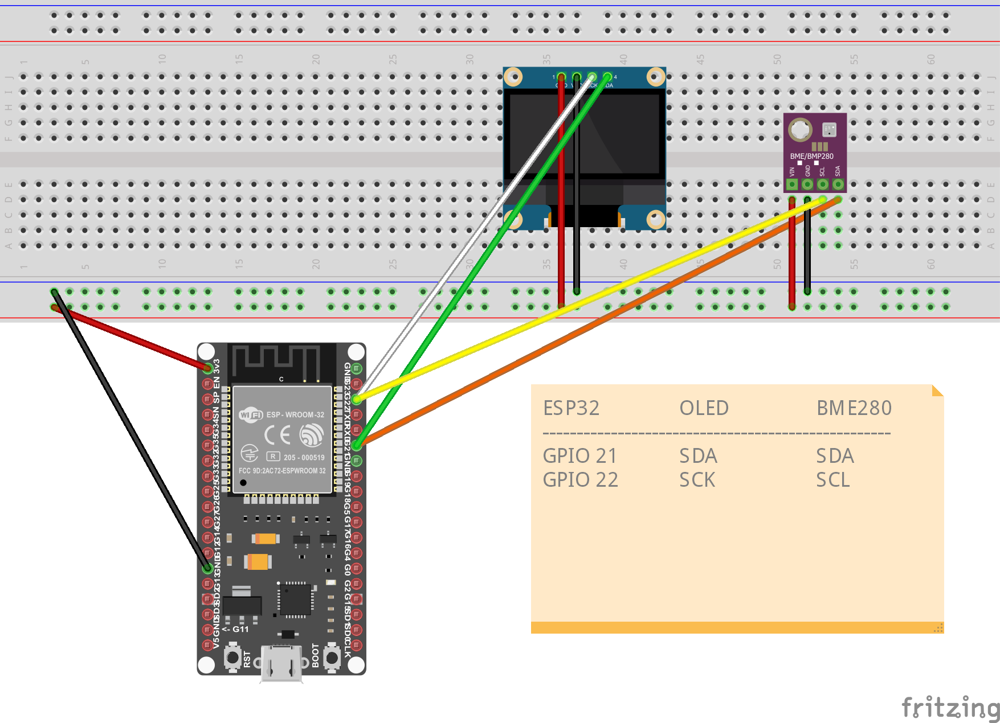

# ESP32 BME280 MQTT Sensor mit OLED Anzeige

Dieses Projekt verwendet einen **ESP32**, um Umweltdaten mit einem **BME280 Sensor** zu messen und per **MQTT** an einen Broker zu senden.
Die aktuellen Messwerte werden zusätzlich auf einem **SH1106 OLED Display (128x64)** angezeigt.

Das Projekt ist für den Dauerbetrieb in einem Heimnetz gedacht und kann optional später mit **Deep Sleep** betrieben werden, um Strom zu sparen.

---

## Features

* WLAN-Verbindung mit automatischem Reconnect
* MQTT-Verbindung zu einem lokalen Broker
* Veröffentlichung der Sensordaten über MQTT
* Anzeige der Messwerte auf einem OLED Display
* Anzeige der **WLAN-IP-Adresse**
* Anzeige der **MQTT-Broker-IP**
* vorbereitet für **Deep-Sleep Betrieb**

---

## Hardware

Benötigte Komponenten:

* ESP32
* BME280 Sensor (I²C)
* SH1106 OLED Display (128×64)
* optional: Stromversorgung über Akku / Solarmodul

### Pinbelegung

| Gerät      | ESP32 Pin |
| ---------- | --------- |
| BME280 SDA | GPIO 21   |
| BME280 SCL | GPIO 22   |
| OLED SDA   | GPIO 21   |
| OLED SCL   | GPIO 22   |

Der BME280 und das OLED Display teilen sich den gleichen I²C-Bus.

## Verdrahtung



---

## Verwendete Libraries

Für dieses Projekt werden folgende Arduino Libraries benötigt:

* Adafruit BME280
* Adafruit GFX
* Adafruit SH1106
* AsyncMqttClient
* WiFi (ESP32 Core)

Installation über den **Arduino Library Manager** empfohlen.

---

## Installation

1. Repository klonen

```bash
git clone https://github.com/USERNAME/esp32-bme280-mqtt.git
```

2. Datei `secrets_example.h` kopieren und umbenennen

```
secrets_example.h → secrets.h
```

3. WLAN und MQTT Zugangsdaten eintragen.

4. Sketch auf den ESP32 hochladen.

---

## secrets.h Beispiel

```cpp
#define WIFI_SSID "your_wifi"
#define WIFI_PASSWORD "your_password"

#define MQTT_HOST IPAddress(192,168,178,10)
#define MQTT_PORT 1883
```

Die Datei `secrets.h` ist **nicht im Repository enthalten**, damit keine Zugangsdaten veröffentlicht werden.

---

## MQTT Topics

Der ESP32 veröffentlicht folgende Daten:

| Topic                    | Beschreibung     |
| ------------------------ | ---------------- |
| esp32/bme280/temperature | Temperatur       |
| esp32/bme280/humidity    | Luftfeuchtigkeit |
| esp32/bme280/pressure    | Luftdruck        |
| esp32/bme280/altitude    | Höhe             |

---

## OLED Anzeige

Das OLED Display zeigt:

* Temperatur
* Luftfeuchtigkeit
* Luftdruck
* Höhe
* WLAN-IP-Adresse
* MQTT-Broker-IP-Adresse

---

## Screenshot

(Optional: hier später ein Bild des Displays einfügen)

---

## Lizenz

Dieses Projekt steht unter der **MIT License**.

---

## Erweiterungen (Ideen)

Mögliche zukünftige Erweiterungen:

* Deep Sleep zur Stromersparnis
* Batterieüberwachung
* OTA Updates
* mehrere Sensoren
* Integration in Home Assistant

---

## Autor

Projekt erstellt von **codewerkstatt @ mare-media.com**
